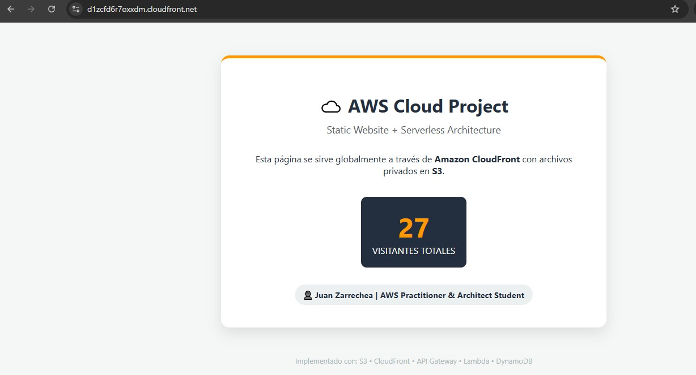

# Lab 01: Web Estática Segura con S3 y CloudFront

## Objetivo
Desplegar un sitio web estático distribuido globalmente, asegurando que el contenido solo sea accesible a través de la CDN (CloudFront) y no directamente desde el bucket de S3.

## Servicios Utilizados
- **Amazon S3**: Alojamiento de archivos estáticos.
- **Amazon CloudFront**: Distribución de contenido (CDN).
- **IAM / Bucket Policy**: Control de acceso de mínimo privilegio.
- **OAC (Origin Access Control)**: Restricción de acceso al bucket.

## Logros
- Configuré **OAC** para que el bucket S3 sea 100% privado.
- Implementé una **Bucket Policy** que solo permite tráfico desde el ARN de mi distribución.
- Reduje la latencia de acceso de ~200ms a ~18ms mediante el uso de Edge Locations.

## Evidencia

