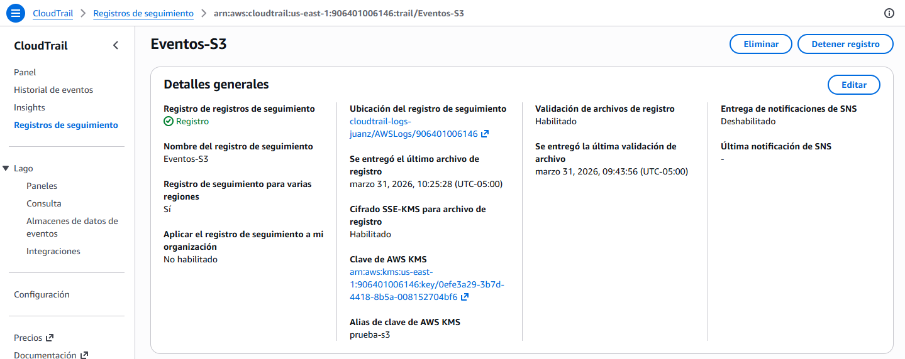
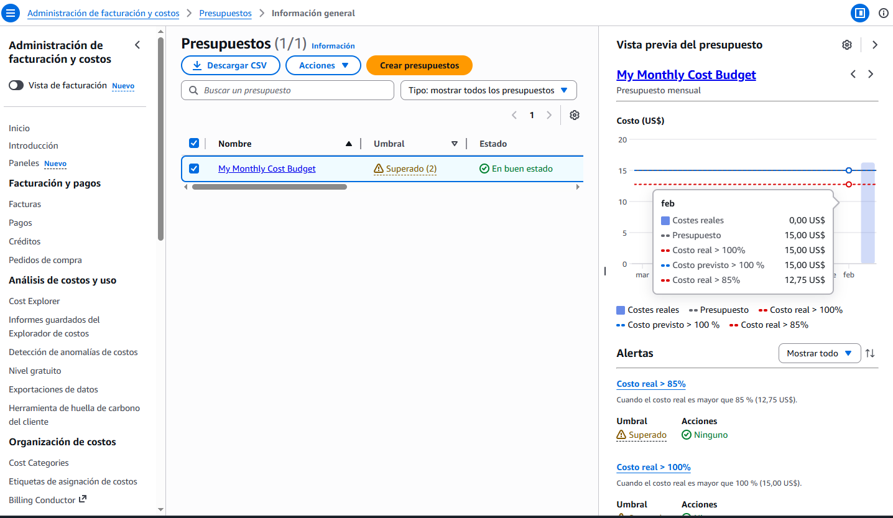

# Lab 05: Seguridad, Auditoría y FinOps 🔐

## 🎯 Objetivo
Establecer las bases de gobernanza y seguridad de la cuenta de AWS, aplicando el principio de "menor privilegio", auditoría continua y control financiero proactivo.

---

## 🛠️ Implementación Técnica

### 1. Gestión de Identidades y Accesos (IAM)
Se eliminó el uso de la cuenta Root para tareas diarias y se implementó una estructura de permisos granulares:
- **MFA Obligatorio**: Activación de autenticación de múltiples factores para todas las identidades administrativas.
- **Políticas JSON**: Implementación de políticas personalizadas con condiciones de seguridad.

> **Evidencia: Política de Seguridad con Condición MFA**
> 
> *Configuración de acceso administrativo condicionado a la presencia de MFA.*

### 2. Auditoría con CloudTrail
Configuración de un rastro de auditoría global para monitorear cada acción realizada en la infraestructura:
- **Cifrado SSE-KMS**: Seguridad de los logs en reposo.
- **Validación de Log**: Activada para garantizar la integridad de los datos (Anti-tampering).

> **Evidencia: Configuración de CloudTrail**
> 
> *Rastro de auditoría global con cifrado activo.*

### 3. Control de Costos (FinOps)
Implementación de **AWS Budgets** para evitar sorpresas en la facturación y mantener el gasto dentro de los límites del laboratorio.
- **Límite Mensual**: $15.00 USD.
- **Alertas**: Notificaciones al alcanzar el 80% del umbral de gasto.

> **Evidencia: Estado del Presupuesto**
> 
> *Control de gastos en tiempo real con alertas configuradas.*

---

## 📈 Resultados del Laboratorio
1. **Hardening de Cuenta**: Seguridad reforzada mediante identidades federadas/limitadas.
2. **Cumplimiento**: Registro histórico de eventos para análisis forense o auditorías.
3. **Visibilidad Financiera**: Capacidad de detectar recursos olvidados (como los del Lab 04) antes de generar costos excesivos.

---
[Ir al Portfolio Principal](../README.md)